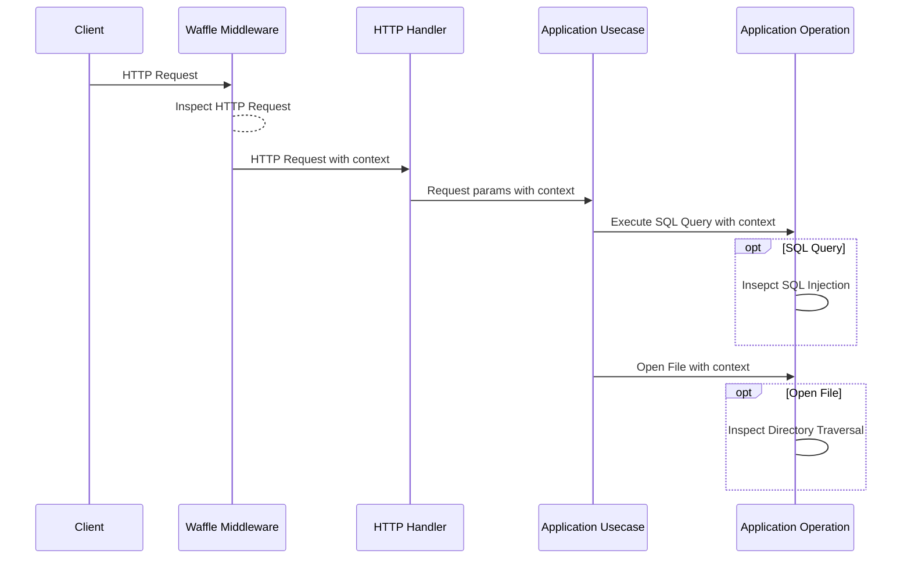

# Operation Context Propagation

to en: Waffle provides a way to propagate context within your application to accurately detect security events.  
You can detect threats in specific processes within your application, such as executing SQL queries and opening files, not just HTTP request parameters.

For example, consider the following sequence diagram.
The application receives an HTTP request and executes an SQL query using the parameters included in the request.
In this case, Waffle propagates the context from the HTTP request to the application's processing, and performs security checks even when executing the SQL query.

Traditional WAFs inspect whether the payload of an HTTP request parameter contains an SQL injection.
Even if the application uses prepared statements (i.e., SQL injection does not occur), the WAF detects SQL injection.

Waffle is embedded in the application, so it can skip the inspection of SQL injection by considering whether prepared statements are used.
This allows you to perform accurate security checks tailored to your application's processing.

