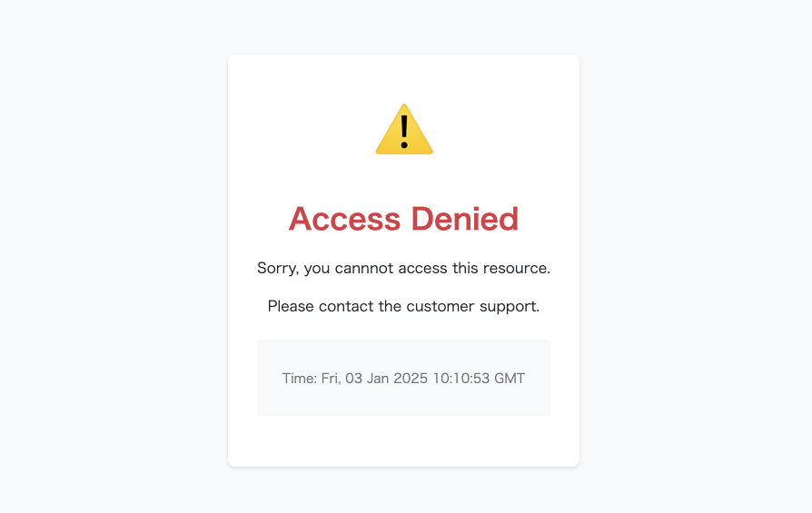

# Customize Block Response

Waffle displays the following page when it blocks an attack.



If you want to change the response, you can customize it using `WithCustomBlockedResponse()`.

```go
import (
	"github.com/sitebatch/waffle-go"
)

responseHTML := []byte(`<html><body><h1>Blocked by Waffle</h1></body></html>`)
waffle.Start(waffle.WithCustomBlockedResponse(responseHTML, nil))
```